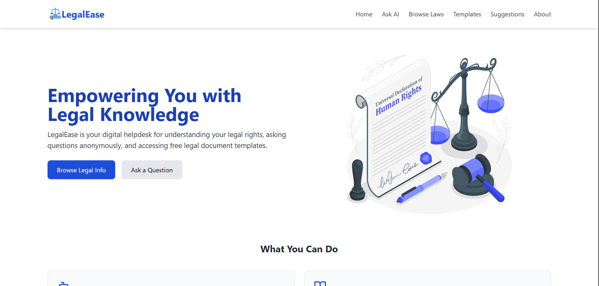
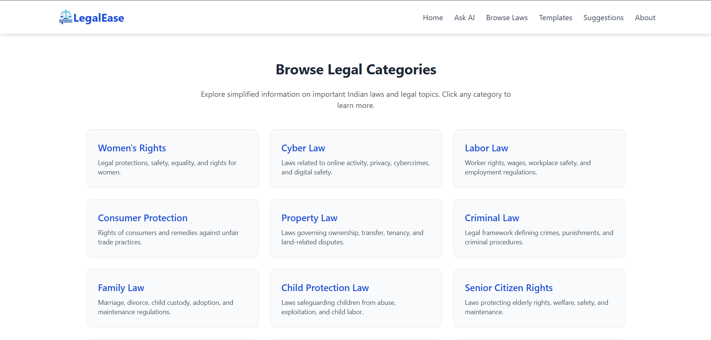
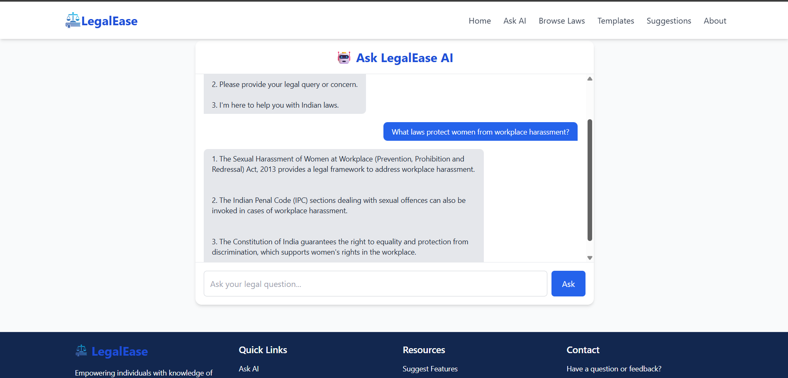
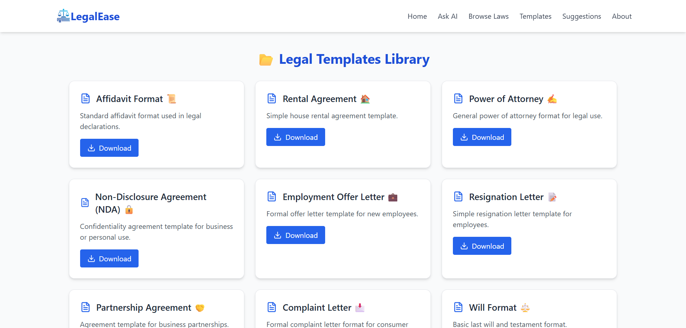
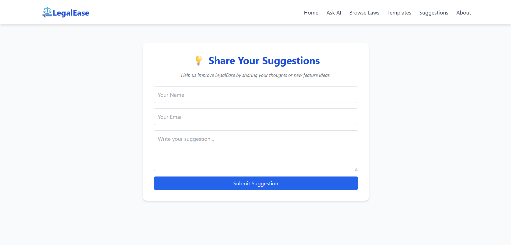

# ⚖️ LegalEase

LegalEase is a MERN Stack-based web application that simplifies access to legal information through AI-powered assistance, downloadable legal templates, and categorized legal resources. The platform is designed to help users understand legal concepts more easily and access useful legal documents in one place.

## 🌐 Live Demo

👉 https://legal-ease-pink.vercel.app/

---

## 📖 About the Project

LegalEase aims to bridge the gap between complex legal information and everyday users by providing a simple and accessible platform for legal guidance. Users can browse legal topics, download legal templates, interact with an AI assistant, and share feedback through the suggestion page.

---

## ✨ Features

### 📚 Browse Laws
- Explore legal information organized into categories.
- Easy-to-understand legal content.
- Simple and intuitive navigation.

### 🤖 AI Legal Assistant
- AI-powered legal guidance using OpenAI API.
- Interactive chatbot experience.
- Quick access to legal information and explanations.

### 📄 Downloadable Legal Templates
- Access commonly used legal document templates.
- Download templates directly from the platform.
- Organized collection for easy browsing.

### 💡 Suggestion Page
- Submit suggestions and feedback.
- Help improve the platform through user input.

---

## 🛠️ Tech Stack

### Frontend
- React.js
- React Router
- CSS
- Axios

### Backend
- Node.js
- Express.js

### Database
- MongoDB Atlas

### AI Integration
- OpenAI API

### Deployment
- Vercel (Frontend)
- Render (Backend)

---

## 📂 Project Structure

```text
LegalEase
│
├── client
│
├── server
│
├── screenshots
│
└── README.md
```

---

## 📸 Screenshots

### Home Page



### Browse Laws



### AI Assistant



### Legal Templates



### Suggestion Page



---

## ⚙️ Installation

### Clone the Repository

```bash
git clone https://github.com/Gayathri-Janagiraman/LegalEase.git
cd LegalEase
```

### Install Frontend Dependencies

```bash
cd client
npm install
```

### Install Backend Dependencies

```bash
cd ../server
npm install
```

---

## 🔑 Environment Variables

Create a `.env` file inside the server directory:

```env
PORT=5000
MONGO_URI=your_mongodb_connection_string
OPENAI_API_KEY=your_openai_api_key
```

---

## ▶️ Run Locally

### Start Backend

```bash
cd server
npm start
```

### Start Frontend

```bash
cd client
npm run dev
```

---

## 🎯 Future Enhancements

- User authentication
- Multi-language support
- Advanced legal search
- Additional legal templates
- Personalized recommendations
- Enhanced AI assistance capabilities

---

## 📚 Learning Outcomes

This project helped me gain practical experience in:

- Building full-stack applications using the MERN Stack
- Designing RESTful APIs with Express.js
- Integrating OpenAI API into a real-world application
- Managing data using MongoDB Atlas
- Deploying applications with Vercel and Render
- Creating responsive and user-friendly interfaces using React

---

## 📄 License

This project is developed for educational and portfolio purposes.

---

⭐ If you found this project useful, consider giving it a star.
